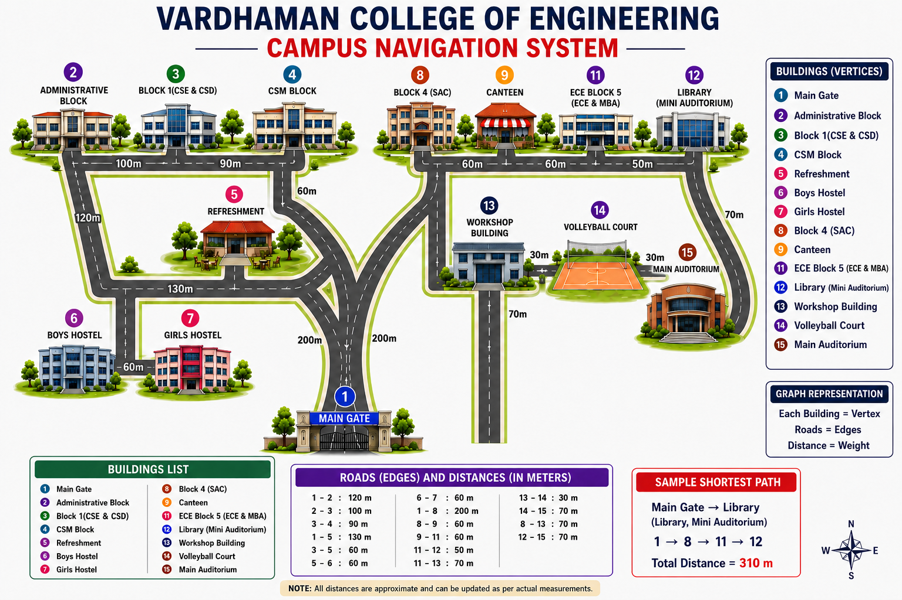
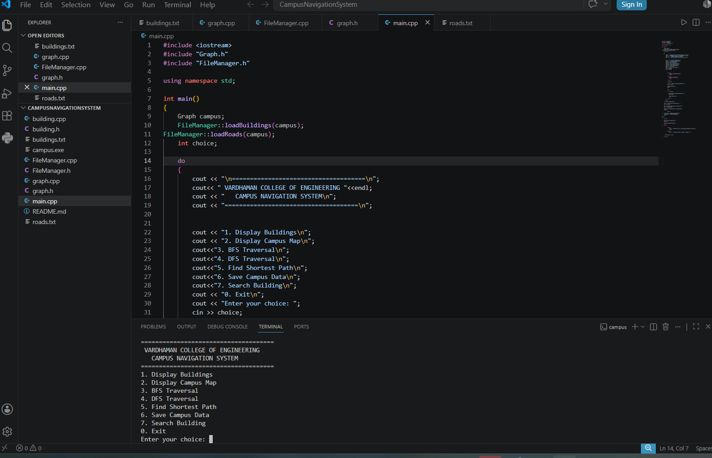
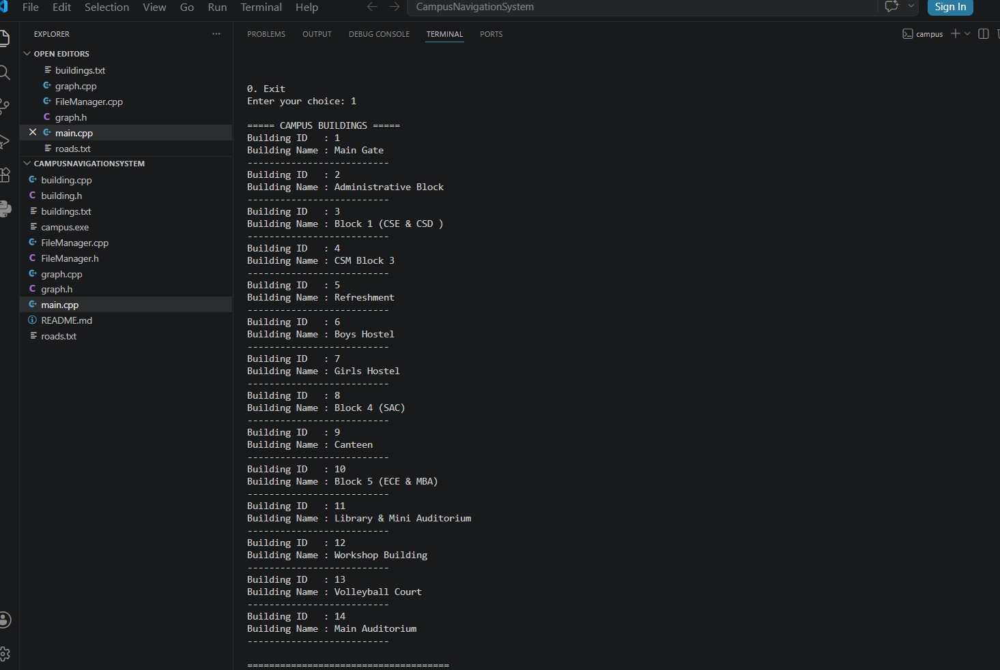
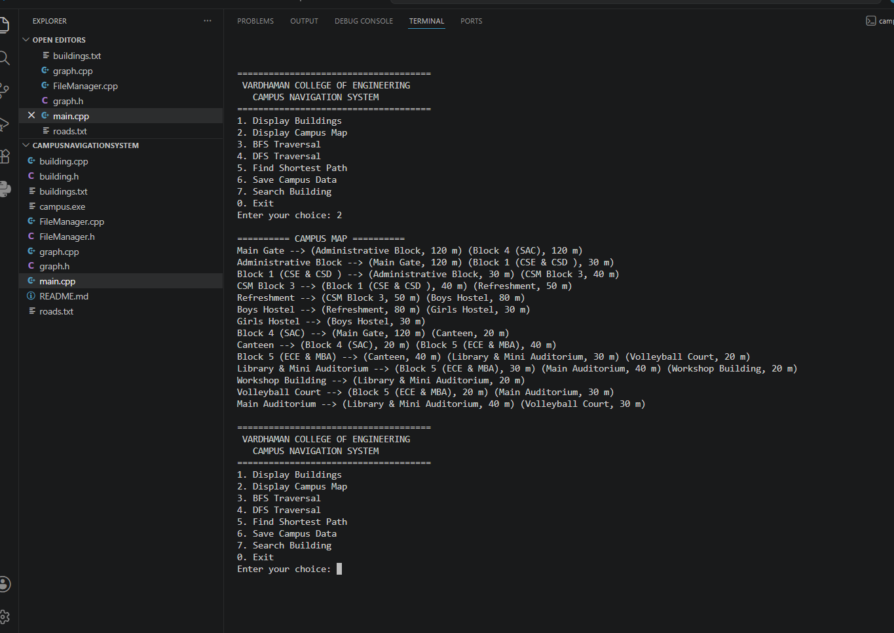
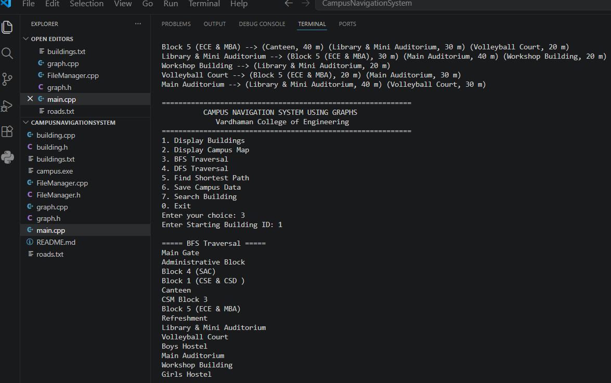
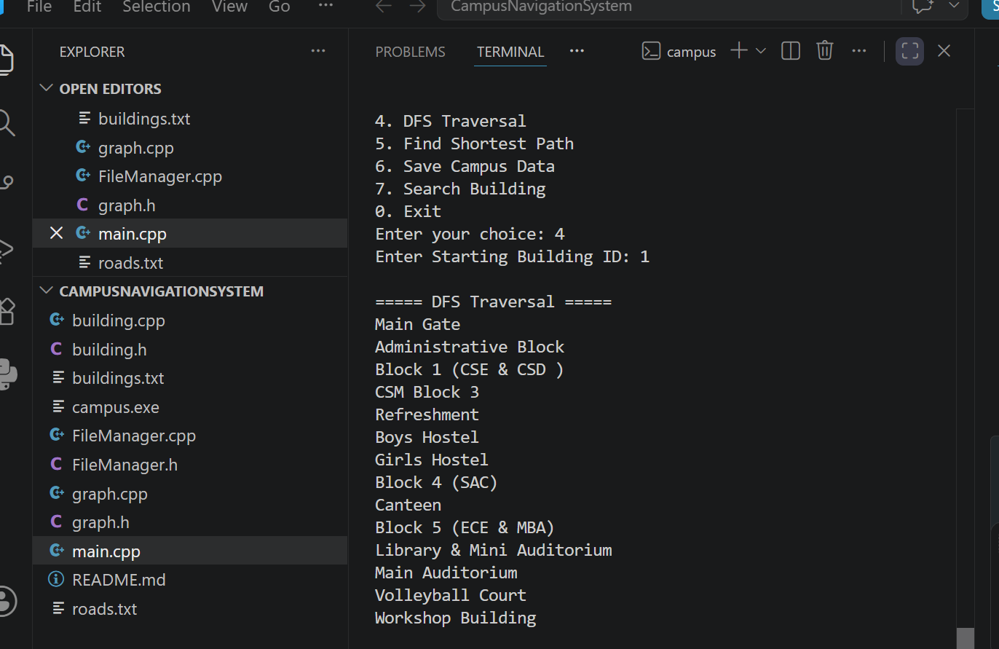
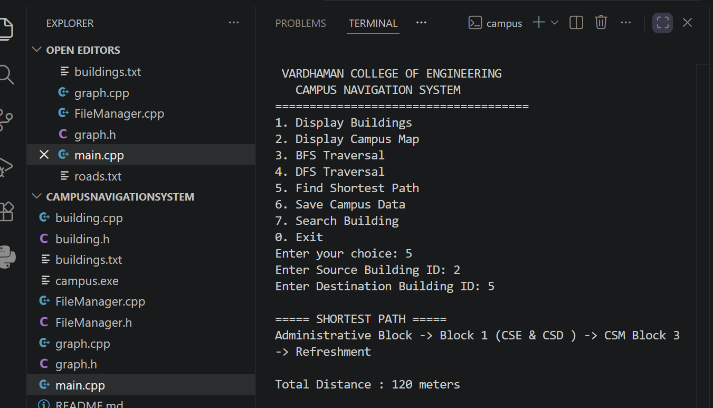
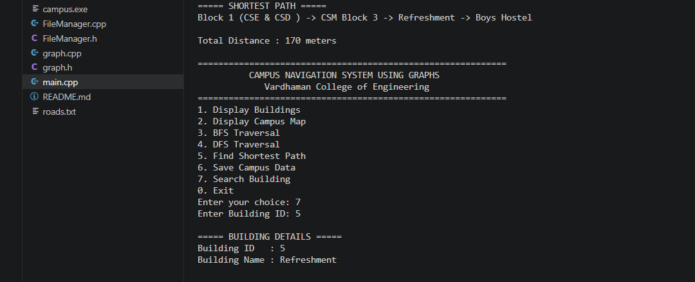

<div align="center">

# 🏫 Campus Navigation System Using Graphs

### *Navigate Smarter • Explore Faster • Discover Every Path*

### A Modern C++ Console-Based Campus Navigation Solution


---

**Summer Project 2025–2026**

**Department of Computer Science and Engineering**

**Vardhaman College of Engineering**

---

*A graph-powered navigation system that models buildings as vertices and roads as weighted edges to efficiently explore campus connectivity and compute the shortest path between locations.*

</div>

---

# 👥 Project Team

| Role | Name |
|------|------|
|  Mentor | P.Rajesh |
|  Team Leader | M.Nishitha |
|  Member | B.Hasini|
|  Member | N.Anirudh Reddy |
|  Member | B.Upender |


---

# 📖 Introduction

Campus navigation plays an important role in helping students, faculty members, staff, and visitors move efficiently across a large educational institution. As campuses continue to expand with multiple academic blocks, laboratories, libraries, auditoriums, hostels, and administrative buildings, identifying the shortest and most convenient route becomes increasingly challenging.

The **Campus Navigation System Using Graphs** is a console-based application developed in **C++** that demonstrates how graph data structures can be applied to solve real-world navigation problems. In this system, every building is represented as a **vertex**, while the roads connecting them are represented as **weighted edges**, creating a graph that models the campus layout.

By implementing graph traversal techniques such as **Breadth First Search (BFS)** and **Depth First Search (DFS)**, along with **Dijkstra's Shortest Path Algorithm**, the application enables users to explore campus connectivity and determine the shortest route between any two buildings efficiently.

Apart from providing navigation functionality, the project also serves as an educational demonstration of **Object-Oriented Programming (OOP)**, **Graph Data Structures**, **Standard Template Library (STL)**, and **File Handling** concepts in C++.

# 🗺 Campus Layout

<p align="center">

</p>

# 📖 About the Project

Navigating through a large educational campus can be challenging, especially for new students, visitors, and faculty members. Finding the nearest route between multiple academic blocks often requires prior knowledge of the campus layout.

The **Campus Navigation System Using Graphs** is a **C++ console-based application** developed to solve this problem using the **Graph Data Structure**.

In this system:

- 🏢 Buildings are represented as **Vertices (Nodes)**
- 🛣 Roads are represented as **Weighted Edges**
- 📏 Distances are stored as edge weights

The application allows users to visualize campus connectivity, perform graph traversals, search for buildings, and calculate the shortest route between any two locations using **Dijkstra's Shortest Path Algorithm**.

The project demonstrates practical implementation of **Object-Oriented Programming (OOP)**, **Graph Algorithms**, **File Handling**, and the **Standard Template Library (STL)** through a real-world navigation application.

---

# 🎯 Project Objectives

- Model a real-world campus using Graph Data Structures
- Represent buildings and roads efficiently using an Adjacency List
- Perform Breadth First Search (BFS) traversal
- Perform Depth First Search (DFS) traversal
- Calculate the shortest route using Dijkstra's Algorithm
- Demonstrate Object-Oriented Programming concepts
- Store campus information using File Handling
- Build a reusable navigation framework adaptable to any educational institution

---

# ✨ Key Features

| Feature | Description |
|---------|-------------|
| 🏢 Display Buildings | View all campus buildings |
| 🗺 Display Campus Map | Show graph connectivity between buildings |
| 🌐 Breadth First Search | Traverse the campus level by level |
| 🌳 Depth First Search | Traverse the campus depth wise |
| 📍 Shortest Path | Find minimum distance between two buildings |
| 🔍 Search Building | Search buildings using Building ID |
| 💾 Save Campus Data | Save buildings and roads into text files |
| 📂 Automatic Data Loading | Automatically load saved data during startup |
| ⚡ Efficient Graph Storage | Implemented using Adjacency List |

---

# 🧩 Graph Representation

```
                Building A
                     ●
                   /   \
              40m /     \ 25m
                 /       \
                ●---------●
          Building B   Building C
                 \       /
             30m  \     / 20m
                   \   /
                    \ /
                     ●
               Building D
```

**Vertices → Buildings**

**Edges → Roads**

**Weights → Distance (meters)**

---

# ⚙ Algorithms Implemented

| Algorithm | Purpose | Time Complexity |
|-----------|---------|----------------|
| Breadth First Search (BFS) | Graph Traversal | O(V + E) |
| Depth First Search (DFS) | Graph Traversal | O(V + E) |
| Dijkstra's Algorithm | Shortest Path | O((V + E) log V) |

Where:

- **V** = Number of Buildings
- **E** = Number of Roads

---

# 🏗 Object-Oriented Programming Concepts

| Concept | Implementation |
|----------|---------------|
| Encapsulation | Building and Graph classes with private members |
| Abstraction | Graph operations hidden through public methods |
| Object-Oriented Design | Modular class-based architecture |
| File Handling | Automatic loading and saving using text files |
| STL Containers | Vector, Queue, Stack, Priority Queue |

---

# 📂 Project Structure

```text
Campus-Navigation-System-Using-Graphs/
│
├── main.cpp
├── Graph.cpp
├── Graph.h
├── Building.cpp
├── Building.h
├── FileManager.cpp
├── FileManager.h
├── buildings.txt
├── roads.txt
├── CampusMap.png
├── README.md
│
├── screenshots/
│   ├── menu.png
│   ├── buildings.png
│   ├── campus_map.png
│   ├── bfs.png
│   ├── dfs.png
│   ├── shortest_path.png
│   └── search.png
│
└── docs/
    ├── Project_Report.pdf
    └── Presentation.pptx
```
# 🚀 Getting Started

## 📋 Prerequisites

Before running the project, ensure you have:

- C++17 compatible compiler (GCC, G++, MinGW, or MSYS2)
- Visual Studio Code, Code::Blocks, or any C++ IDE
- Git (Optional)

---

## 📥 Clone the Repository

```bash
git clone https://github.com/hasinibantu/Campus-Navigation-System-Using-Graphs.git
```

```bash
cd Campus-Navigation-System-Using-Graphs
```

---

## ⚙️ Compile the Project

Compile all source files using:

```bash
g++ main.cpp Graph.cpp Building.cpp FileManager.cpp -o campus
```

---

## ▶️ Run the Application

### Windows

```bash
campus.exe
```

### Linux / macOS

```bash
./campus
```

---

## 📂 Required Files

Make sure these files are present in the project directory:

- `buildings.txt`
- `roads.txt`

These files are automatically loaded when the application starts.


---

# 💾 Data Storage

The application stores all campus information using external text files.

### 📄 buildings.txt

Stores:

- Building ID
- Building Name

### 📄 roads.txt

Stores:

- Source Building
- Destination Building
- Distance between Buildings

All files are automatically loaded when the application starts.

---

# 🚀 How the Application Works

1. The application loads all buildings and roads from text files.
2. The campus is stored internally as a weighted graph using an adjacency list.
3. Users can display buildings and campus connectivity.
4. BFS and DFS traverse the campus graph from any selected building.
5. Dijkstra's Algorithm computes the shortest path between two buildings.
6. Building Search locates any building using its ID.
7. Updated campus information can be saved before exiting.

---

# 💻 Technologies Used

- C++
- Object-Oriented Programming
- Graph Data Structure
- Adjacency List
- Breadth First Search (BFS)
- Depth First Search (DFS)
- Dijkstra's Algorithm
- File Handling
- Standard Template Library (STL)

---


> # 📸 Application Screenshots

## 🖥 Main Menu

<p align="center">

</p>

---

## 🏢 Display Buildings

<p align="center">

</p>

---

## 🗺 Campus Map

<p align="center">

</p>

---

## 🌐 BFS Traversal

<p align="center">

</p>

---

## 🌳 DFS Traversal

<p align="center">

</p>

---

## 📍 Shortest Path

<p align="center">

</p>

---

## 🔍 Search Building

<p align="center">

</p>

---

# 🌱 Future Enhancements

- Interactive GUI using Qt
- Search Building by Name
- Mobile Application Integration
- GPS-Based Navigation
- Emergency Route Planning
- Voice-Guided Navigation
- Real-Time Route Optimization
- Interactive Campus Map Visualization

---

# 📚 Learning Outcomes

Through this project, we gained practical knowledge of:

- Graph Data Structures
- Graph Traversal Algorithms
- Dijkstra's Shortest Path Algorithm
- Object-Oriented Programming
- File Handling
- Standard Template Library
- Software Design Principles
- Team-Based Software Development

---

# 🏛 Academic Information

**Project Title**

Campus Navigation System Using Graphs

**Institution**

Vardhaman College of Engineering

**Department**

Computer Science and Engineering

**Academic Year**

Summer Project (2025–2026)

---

# 📜 License

This project has been developed exclusively for **academic and educational purposes** as part of the **Summer Project (2025–2026)** conducted by the **Department of Computer Science and Engineering, Vardhaman College of Engineering**.

The software is intended solely for learning, demonstration, and evaluation purposes.

---

<div align="center">

### ⭐ Thank you for visiting our project!

**If you found this project helpful, consider giving it a ⭐ on GitHub.**

</div>
